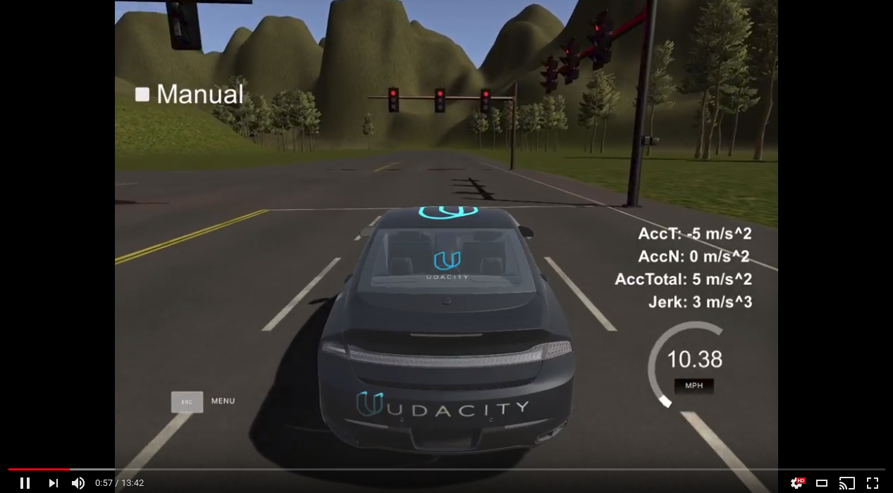
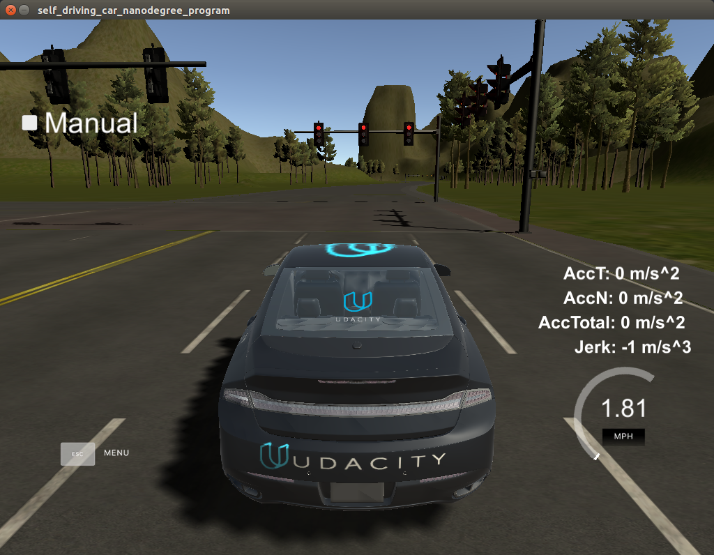

This is the project repo for Programming a Real Self-Driving Car, using TensorFlow, ROS and OpenCV as part of the final project of the Udacity Self-Driving Car Nanodegree. For more information about the project, see the Udacity project repository [here](https://github.com/udacity/CarND-Capstone).

This project is the combined work of;
* [Andre Meeusen](https://github.com/meeuw007) - pmeeusen@hotmail.com
* [Christian Marzahl](https://github.com/ChristianMarzahl) - christian.marzahl@gmail.com
* [Haidyn Mcleod](https://github.com/Heych88) - haidyn.mcleod@gmail.com
* [Kamil Kindziuk](https://github.com/kamil0123) - kamil.kindziuk@gmail.com
* [Punnu Phairatt](https://github.com/LukePhairatt) - luke.phairatt@gmail.com

A video of the project in action using the simulator can be viewed [here](https://youtu.be/5LJfvmMQwCw).

 [](https://youtu.be/5LJfvmMQwCw)

### Stop Light Detection Notebook
An ipython Notebook of the traffic light detection pipeline can be found in `/ros/src/tl_detector/training/TrafficLightPipeline.ipynb`  [here](ros/src/tl_detector/training/TrafficLightPipeline.ipynb).

## System Dependencies
#### Ubuntu
The code requires a workstation running Ubuntu 16.04 Xenial Xerus or Ubuntu 14.04 Trusty Tahir. [Ubuntu downloads can be found here](https://www.ubuntu.com/download/desktop).
* If using a Virtual Machine to install Ubuntu, use the following configuration as a minimum:
  * 2 CPU
  * 2 GB system memory
  * 25 GB of free hard drive space

#### ROS
Follow these instructions to install ROS
  * [ROS Kinetic](http://wiki.ros.org/kinetic/Installation/Ubuntu) if you have Ubuntu 16.04.
  * [ROS Indigo](http://wiki.ros.org/indigo/Installation/Ubuntu) if you have Ubuntu 14.04.

#### Vehicle ROS Model
The Simulator uses the Dataspeed DBW model which can be found here [here](https://bitbucket.org/DataspeedInc/dbw_mkz_ros)
  * Use this option to install the SDK on a workstation that already has ROS installed: [One Line SDK Install (binary)](https://bitbucket.org/DataspeedInc/dbw_mkz_ros/src/81e63fcc335d7b64139d7482017d6a97b405e250/ROS_SETUP.md?fileviewer=file-view-default)

#### Simulator
Download the Udacity Simulator for your host operating system from [here](https://github.com/udacity/CarND-Capstone/releases/tag/v1.2).

If using a Virtual Machine, it is recommended to downloading the simulator for your host operating system and using this outside of the VM. You will be able to run code within the VM while running the simulator natively on the host using port forwarding on port `4567` for both the Host and Guest ports. For more information on how to set up port forwarding, see  [here](https://www.howtogeek.com/122641/how-to-forward-ports-to-a-virtual-machine-and-use-it-as-a-server/).

## Installation and setup
### Docker Installation
Not required, but if you would prefer to use Docker to run the system, Install Docker from [here](https://docs.docker.com/engine/installation/)

Build the docker container
```bash
docker build . -t capstone
```

Run the docker file
```bash
docker run -p 4567:4567 -v $PWD:/capstone -v /tmp/log:/root/.ros/ --rm -it capstone
```

### Build Instructions

1. Clone the project repository
```bash
git clone https://github.com/Heych88/Udacity-CarND-Capstone.git
```

2. Install python dependencies
```bash
cd Udacity-CarND-Capstone
pip install -r requirements.txt
```
3. Make and build the code
```bash
cd ros
catkin_make
source devel/setup.sh
```

### Running Code

1. Run styx
```bash
roslaunch launch/styx.launch
```

2. Run the simulator and *untick* the manual box in the top left of the screen. The car will now drive around the track, stopping at red lights, and you should arrive at a result similar to the below.



### Real world testing
1. Download [training bag](https://drive.google.com/file/d/0B2_h37bMVw3iYkdJTlRSUlJIamM/view?usp=sharing) that was recorded on the Udacity self-driving car (a bag demonstrating the correct predictions in autonomous mode can be found [here](https://drive.google.com/open?id=0B2_h37bMVw3iT0ZEdlF4N01QbHc))
2. Unzip the file
```bash
unzip traffic_light_bag_files.zip
```
3. Play the bag file
```bash
rosbag play -l traffic_light_bag_files/loop_with_traffic_light.bag
```
4. Launch your project in site mode
```bash
cd CarND-Capstone/ros
roslaunch launch/site.launch
```
5. Confirm that traffic light detection works on real-life images
